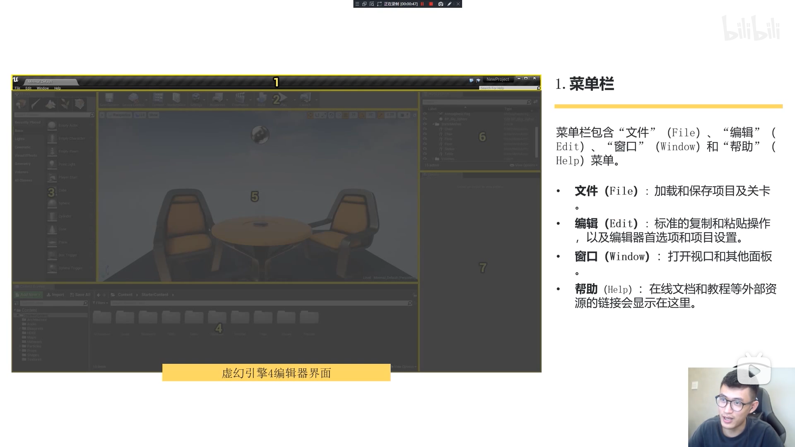

# 05.01超详细编辑界面介绍

##### 菜单栏

文件下面有项目和关卡

> 项目是大于关卡的，一个项目下面可能有几百个关卡

###### 文件

* 关卡
* 项目
* 打包
  * 各个平台
  * 选择去压缩项目
  * 编译
    * 开发
    * 发行版本
  * 打包设计
* 导入到关卡
  * 能够选择我们的模型到场景或者关卡中
    * 模型
    * 场景、关卡
* 导出所有
  * 导出场景中所有的模型
* 导出选中项
  * 导出你选中的模型
* 最近打开的关卡
* 最近打开的项目
* 退出

###### 编辑

> 这里的操作类似于PS

* 撤销
* 复制
* 粘贴
* 拷贝
* 剪切
* 删除

其他

* 编辑器偏好设置
  * 几乎就是引擎参数
  * 语言、等功能都可以在这里调节
  * 针对引擎
* 项目设置
  * 针对项目的设置
* 插件
  * 插件的添加和修改位置在编辑这里

###### 窗口

> 还是类似于PS，这里对应所有的窗口的勾选项

* 勾选项
  * 具体的内容可以拖住某些标题鼠标左键去拖拽，可以吸附到另外的窗口的边缘
* 全屏
  * 快捷键：shift + F11

###### 帮助

* 官方提供的各种外部链接

-----

##### 工具栏

简图：

> tap: 4.22的版本汉化做的不够友好，这里用4.21的引擎来截图和具体讲解

* 左上角黄色箭头

  * 是否展开工具栏的title

* 保存当前关卡

  * 这里不推荐使用
    * 仅仅保存了当前map，对应的资源并没有保存
  * 推荐使用内容浏览器里的保存所有

* 版本管理

  * 用来多人开发的，对于我们java开发可以理解为git

* 内容

  * 对应的操作就是打开内容浏览器

  * 如果不小心关掉了，可以点击这里，也可以选择在窗口这里打开

  * > 这里注意，在窗口这里选择打开的内容浏览器，最多可以同时打开4个

* 市场

  * 外部链接，链接到虚幻商城

* 设置

  * 项目设置
    * 同工具栏下-> 编辑-> 项目设置的功能的
  * 插件
    * 同上
  * 选择
    * 是否可以选择具体的物体
  * 可拓展性设置
    * 电脑配置不高的时候可以在这里更改画质 	 
    * 对应可修改如下内容
      * 引擎本身
      * 材质
    * 预览渲染效果

* 蓝图

  * 新建
  * 打开
    * 蓝图类
    * 关卡蓝图

* 过场动画

  * 添加镜头

* 构建

  * > tap：如果你工具栏视图下面的具体内容里左上角出现了红色的描述，代表有物体被你移动了这时候需要去选择构建，去重新构建光影等等

* 播放

  * 实则是预览效果

* 启动

  * 可以在不同的平台上实现播放

---

##### 模式面板

简图：

